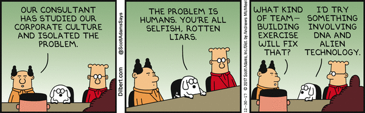

From issue:

Explain how humans have solved the coordination problem before.

Include the following pieces:

Refreshing the reader on the coordination problem: that people don't naturally do what they're supposed to do (maximize benefits to group)
Plato's solution is to centralize control in a small group of 'philosopher kings' (i.e., wise altruists) who care about betterment of the whole. Examples of this are centrally-planned economies (e.g., historical Soviet Union, present-day China to some extent) and theocracies (e.g., Islamic Caliphates, Europe during Middle Ages to a large extent).
Another solution, very common in economic institutions, is to align incentives. As before, you centralize control in a small group and allow them to exert outsized control on the institution, but instead of hoping for altruism you give the group a taste of the group's upside or downside. Founder-led companies & public companies with management stock incentives examples of this. Democracies are also an example of this.
Both are flawed, probably the former more than the latter.
Reason to be skeptical about any human altruists.
Incentive / information ratio is too low. Who votes in stockholder meetings? Who extensively researches political candidates, incl. voting records? Very easy for the people to 'talk the talk w/o walking the walk'
Culture & religion are a third solution for decentralized control & incentive alignment. Fragile because they are based on false premises.

# From Corporations to Nations: How the Meta-DAO is Going to Change Everything (Part 2)

At this point, hopefully you understand the human coordination problem discussed in [part 1](https://medium.com/@metaproph3t/from-corporations-to-nations-how-the-meta-dao-is-going-to-change-everything-part-1-a8657562b12e). For a quick refresher, you can think of the problem as follows:
- Human groups fare best when their members take actions that benefit the group as a whole. For example, a company fares best when its employees are focused on growing it.
- Instead of deciding what actions to take based on what will bring about the greatest good to the group, humans tend to be either greedy, taking actions that benefit themselves at the expense of the group, or conformist, taking whatever action will gain them acceptance in their peer group. For example, many people would prefer 'looting' a company (taking a salary without doing any work) to taking actions that grow the company.
- Wat do?

This problem has been a thorn in the side of mankind for millenia, and many have tried to remove it. Among them include intellectuals such as Plato^1 and Thomas Hobbes^2, statesmen such as the framers of the United States constitution^3, and technology founders such as Jeff Bezos^4 and Reed Hastings^5. Although all have thought about the problem differently, they were all trying to figure out how humans could work better together.

Of course, we believe that the Meta-DAO will blast them all out of the water as an engine of human coordination. But just in case you are not convinced by our proclamation of superiority, we ought to review some of these historical approaches and their limitations. We can group these approaches into three categories, namely **culture and religion**, **philosopher-kingdoms**, and **aligning incentives**. 

## Culture and religion

> "Whatever you wish that others would do to you, do also to them" (Matthew 7:12)

> “Help one another in acts of piety and righteousness. And do not assist each other in acts of sinfulness and transgression. And be aware of Allah. Verily, Allah is severe in punishment” (Quran 5:2).

> "Ask not what your country can do for you – ask what you can do for your country" John F. Kennedy, former U.S. President

> "If you truly loved yourself, you could never hurt another." Buddha

> "Being ethical turns out to be a selfish imperative. You want to be ethical because it attracts the other long-term players in the network... so being ethical pays off in the long run." Naval Ravikant, high priest in Silicon Valley

Imagine a city where all residents believe the above statements. Now imagine an alternate city where all residents believe "my only imperative is maximizing my own interest, which usually means screwing other people over." How would these two cities differ? 

Some challenges the second city might face include:
1. [NIMBYism](https://en.wikipedia.org/wiki/NIMBY), or the non-optimal restricting of housing supply to keep home prices high for existing homeowners.
2. Exploiting of public resources, including people littering on sidewalks, stealing electricity, dumping waste, etc.
3. Politicians who are laser-focused on the next election cycle instead of improving residents' lives

The first city might face these challenges too, but would probably face them to a smaller degree. Its residents would be more oriented towards the group as a whole and would be more willing to make sacrifices for the sake of the group. 

This is the core of culture and religion: exploit the fact that people generally conform to the ideas around them and spread ideas that make them take actions for the benefit of the greater good. These ideas don't even need to be true, they just need to be beneficial for the group. Examples of this are the golden rule and "be good to people and you'll spend eternity in paradise, be bad to people and you'll spend eternity in a fiery pit."

Cultures and relions have some problems though, some of which the reader has most likely encountered. These include:
- When a group depends on its members following a pre-set list of rules in a sheeplike manner, that group tends to adapt poorly to new environments that make their old rules invalid. See, for example, Islamic Law's impact on the stagnation of the Middle East.^6
- Wolfs who really self-maximize at the expense of others can mask as sheep who follow the culture's ethics by simply "[saying] all the right shibboleths," in the words of likely wolf Sam Bankman-Fried.^7
- Because cultures only exist in the minds of humans, and because humans are fickle, good cultures can be replaced by bad cultures. Hence the meme "hard times create strong men, strong men create good times, good times create weak men, weak men create hard times."
- Even if a culture emphasizes the greater good, the masses that follow that culture may now understand *how* to bring the greater good about. 

### Philosopher-kingdoms

"The people have no understanding and only repeat what their rulers tell them." Plato, *The Republic Book VI*

Plato believed that this first problem was especially corrosive. That is, he believed that humans were by and large stupid. And so, his idea was to **centralize control in a small group of wise, altruistic leaders.** These leaders would only focus on the global costs and benefits of their actions, and wouldn't think about themselves.

Because they would be both wise and altruistic, they could be trusted to manage the society in all of its aspects. For example, these so-called philosopher-kings would decide on laws and control what work the citizens did during the day.

Some examples of this system at work might include the Catholic Church during Medieval Europe and present-day Singapore and China to some extent. 

Since an organization being governed by an extremely wise (able to discern global benefits and costs) and altruistic (focused only on global rather than local impacts) leader would indeed solve the human coordination problem, most criticisms are that such people do not exist. For example:
- "The problem with philosopher-kings is that they are still human beings, and human beings are fallible. Putting too much power in the hands of a single person, even if that person is a philosopher, is a recipe for disaster." Bertrand Russell
- "It is hard to imagine a more stupid or more dangerous way of making decisions than by putting those decisions in the hands of people who pay no price for being wrong." Thomas Sowell

### Aligning incentives

A third approach which has gained wide adoption in the modern world is to 'align incentives.' As in a philosopher-kingdom, power is centralized in a central command structure. Unlike a philosopher-kingdom, this central command structure is at least in theory accountable to the stakeholders of the organization.

Prominent examples of this approach include democracies and public companies. You may not think of politicians and professional managers as similar, but structurally they perform the same task: act on behalf of a group that votes them in.

In this way, these central administrators are supposed to feel the global benefits and costs of their actions. For example, if a politician upsets the masses by making a bad decision, this may hurt their chances in the next election cycle. If a management team isn't working in the interest of the stockholders, an activist investor may swoop in and kick them out.

The theory is that managers no longer need to be altruistic, they just need to be wise. Their incentives will be aligned with the group as a whole, and so them trying to maximize for their individual interests will lead them to maximize for the group's interests.

Unfortunately, practice is messier than theory. While whole books have been devoted to the problems here^6, we can encapsulate these problems in one sentence: unsufficient alignment. In all voting-based systems, the voters have very weak incentive to research their appointees, which means that those in charge have a very weak incentive to further the group's interest. Politicians and management teams alike are usually focused more on extracting as much as possible from the institution, rather than growing it, and they can get away with it because the voters don't watch over.

[1]: https://en.wikipedia.org/wiki/Republic_(Plato)
[2]: https://en.wikipedia.org/wiki/Leviathan_(Hobbes_book)
[3]: https://constitution.congress.gov/constitution/
[4]: https://www.aboutamazon.com/about-us/leadership-principles
[5]: https://www.slideshare.net/AytaKorkusuz/reed-hastings-ceo-netflix-culture
[6]: http://www.lpbr.net/2012/06/long-divergence-how-islamic-law-held.html
[7]: https://www.vox.com/future-perfect/23462333/sam-bankman-fried-ftx-cryptocurrency-effective-altruism-crypto-bahamas-philanthropy

[1]: https://www.un.org/en/about-us/member-states
[2]: https://focus.world-exchanges.org/articles/number-listed-companies
[3]: https://www.reference.com/world-view/many-religions-world-8f3af083e8592895
[4]: https://www.newworldencyclopedia.org/entry/Institutional_economics
[5]: https://www.vox.com/future-perfect/23462333/sam-bankman-fried-ftx-cryptocurrency-effective-altruism-crypto-bahamas-philanthropy
[6]: https://books.google.com/books/about/Managing_the_Commons_Second_Edition.html?id=Td2turpuRX8C
