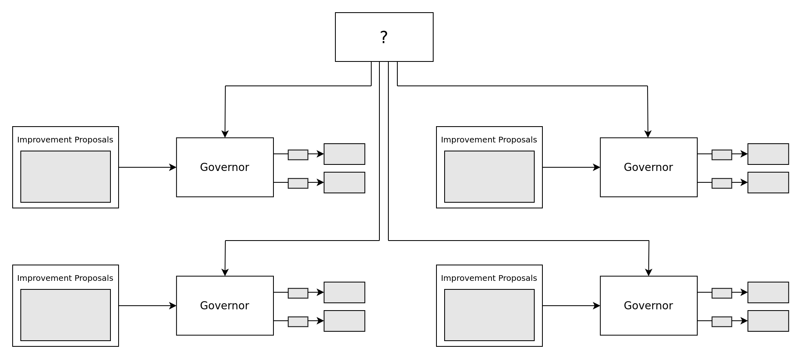
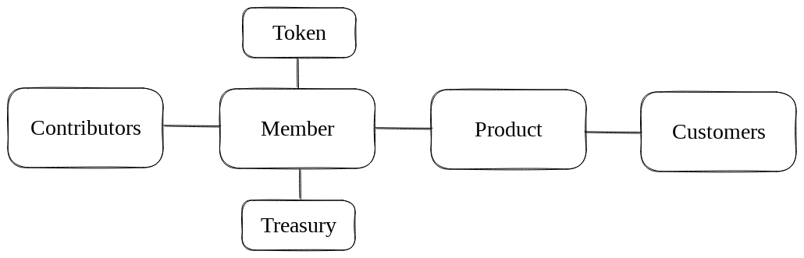
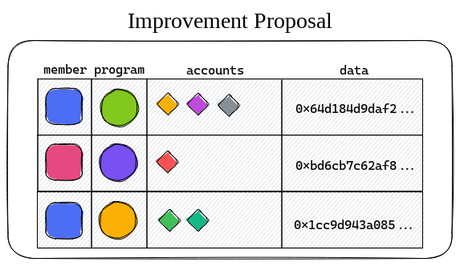
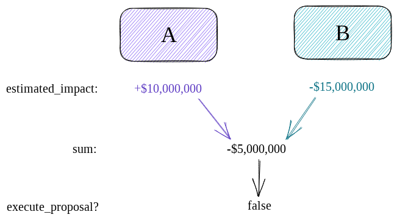
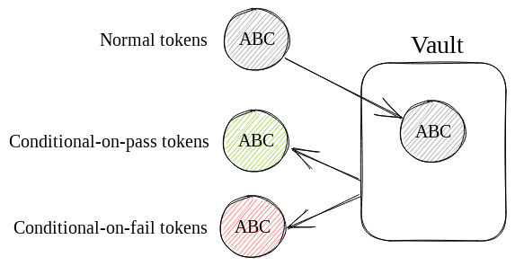
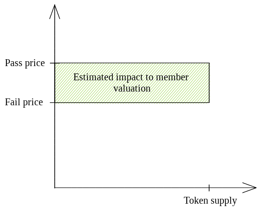

# From Corporations to Nations: How the Meta-DAO is Going to Change Everything (Part 3)

## Abstract

[Existing approaches to human organization](https://medium.com/@metaproph3t/from-corporations-to-nations-how-the-meta-dao-is-going-to-change-everything-part-2-8abe5b6814fc) have human rulers. Whether the organizations be corporations or national governments and whether the rulers be CEOs, board members, prime ministers, congressmen, or ayatollahs, the structure is mostly the same: humans appointed to serve the interests of the group.

Although these approaches are better than no organization at all, they suffer from the [principal-agent problem](https://en.wikipedia.org/wiki/Principal%E2%80%93agent_problem). Simply stated, these rulers often take self-serving actions that hurt the group.[^1]

We propose an alternative organization where control is handed to executable computer code, namely eBPF instructions stored on the Solana blockchain. We will describe the mechanics of this organization in this post.

As a TL;DR:
- The organization is broken up into smaller organizations called members. Members operate businesses and have tokens that function like common stock.
- When the organization is deciding on a potential action, an algorithm automatically estimates how that action will impact each member, and only takes actions that are net-positive for the group as a whole.
- To estimate how an action will impact a member, we use a market-based system.

## Members

We define members as single-product profit-seeking entities. Members have their own treasuries, from which they can pay grants, payroll, and suppliers. Each member also has its own token, which functions like common equity in a company.

## Proposals

As in many existing DAOs, members take actions via improvement proposals.[^2] Each improvement proposal contains a list of commands, where a command contains a member and a Solana [instruction](https://docs.solana.com/terminology#instruction) that the member can execute.[^3] If a proposal passes, instructions are executed by their corresponding members.

## Decision-making apparatus

To decide whether or not to execute an improvement proposal, the Meta-DAO does the following:

1. Estimate, in some base currency, the impact of this proposal on each member's valuation.
2. Summate all of these estimated impacts.
3. Execute the proposal if, and only if, the resulting sum is positive.

For example, consider a proposal for member A to raise its prices. This would benefit A by bolstering profitability. On the other hand, member B shares a brand with A, and B is likely to be hurt by this since it would tarnish the low-price brand image that B has tried to build.

Following step 1, the algorithm estimates that a proposal would increase A's valuation by $10MM by decrease B's by $15MM. In other words, the proposal has expected impacts of +$10MM and -$15MM. Step 2 would result in -$5MM, which would lead the algorithm to not execute the proposal in step 3 since -$5MM is negative.

This algorithm is ideal, by [post 1](https://medium.com/@metaproph3t/from-corporations-to-nations-how-the-meta-dao-is-going-to-change-everything-part-1-a8657562b12e)'s definition of an ideal decision-making algorithm, because it takes an action if, and only if, its global benefits outweigh its global costs. Specifically, any proposal needs to be expected to grow the total wealth of the system in order to pass.

## Estimating impact

To estimate how a proposal will impact a member's valuation, we use a system based on [Robin Hanson's futarchy](https://mason.gmu.edu/~rhanson/futarchy.html). 

While a proposal is active, investors can lock arbitrary tokens into a *vault* in exchange for two convertible instruments: one that converts back to the token if the proposal passes and one that converts if it fails. We call the former a *convertible-on-pass* token and the latter a *convertible-on-fail* token.

Investors may trade these convertible instruments freely. One of their use-cases is betting on how a proposal will affect a member.

For example, if investors believe that a member token would be worth 10 SOL if a proposal were to pass, but a convertible-on-pass member token could be had for 9 convertible-on-pass SOL, investors are incentivized to lock up their SOL in the vault and trade the resultant convertible-on-pass SOL for convertible-on-pass member token until the price reaches 10 convertible-on-pass SOL. 

If the proposal passes, the investor has locked in the cheaper price; if the proposal fails, they can still get their original SOL back.

Importantly, we can use the market prices of these convertible instruments to estimate the impact of a proposal on a member's valuation. A *pass price*, or the market's estimate of what a member's token would be worth if the proposal were to pass, is simply the price of convertible-on-pass member tokens, quoted in convertible-on-pass base tokens. Likewise, the *fail price*, the market's estimate of what the token would be worth if the proposal failed, is 
just the price of convertible-on-fail member tokens, quoted in convertible-on-fail base tokens.

Once we have the pass price and the fail price, calculating the market's estimate of the proposal's impact on this member's valuation is a simple matter of subtracting the fail price from the pass price and then multiplying by the token's total supply.

## Questions and objections

Many futarchy-specific objections and their responses can be found [here](https://mason.gmu.edu/~rhanson/futarchy2013.pdf).

Questions and objections that don't relate to futarchy are enumerated and responded to here.

### Why would you take away this power from humans? Doesn't this undermine human sovereignty?

As discussed in part 2, appointing humans as leaders is problematic. Too often in history, those leaders have abused their position to enrich themselves at the expense of the broader group. This isn't just a phenomena to be observed in cases of visible corruption, but a phenomena to be observed in every corporate board of directors meeting.

As to whether this would undermine human sovereignty, it depends which humans we are discussing. Those who advocate for proposals that are based on reason and add value to the organization are more likely to see those proposals implemented than in traditional organizations. On the other hand, the Meta-DAO has no need for 'consensus-builders' who push proposals through in a pork barrel-style, and they are unlikely to fare so well.

### Couldn't this hurt the broader world?

The algorithm only explicitly optimizes for the interests of members and not for the interests of society more broadly. It is reasonable to ask, then, if this could lead to undesirable outcomes.

Truthfully, noone can answer this question with certainty, but we conjecture that long-term greed (that which the algorithm practices) is beneficial to society because it leads to the creation of new products and the reduction of costs.

It's also worth noting that many of our institutions are already dominated by 'greedy' humans, only where their greed is confined to themselves as individuals. In contrast, the algorithm is greedy for the group as a whole.

## Conclusion

We have demonstrated a design for a human organization where the managerial decisions are made by eBPF instructions on the Solana blockchain. Because this system is not human-led, it doesn't suffer many of the problems of prior approaches to human organization. 

[^1]: We discussed these problems in part 2. For further examples and discussion of this, see [principal-agent problems](https://en.wikipedia.org/wiki/Principal%E2%80%93agent_problem), [corporate governance](https://en.wikipedia.org/wiki/Corporate_governance), [political corruption](https://en.wikipedia.org/wiki/Political_corruption), [regulatory capture](https://en.wikipedia.org/wiki/Regulatory_capture), and [gerrymandering](https://en.wikipedia.org/wiki/Gerrymandering).
[^2]: This system is described in [Compound Governance](https://medium.com/compound-finance/compound-governance-5531f524cf68).
[^3]: We say that 'members execute instructions' because it is intuitive and describes the high-level process accurately. Under the hood though, really what's happening is that the Meta-DAO program is calling [`solana_program::program::invoke_signed`](https://docs.rs/solana-program/latest/solana_program/program/fn.invoke_signed.html) with that member's PDA seeds. 

