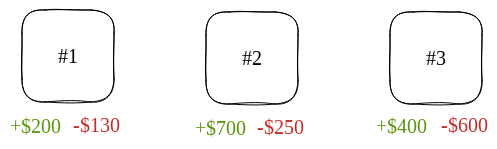
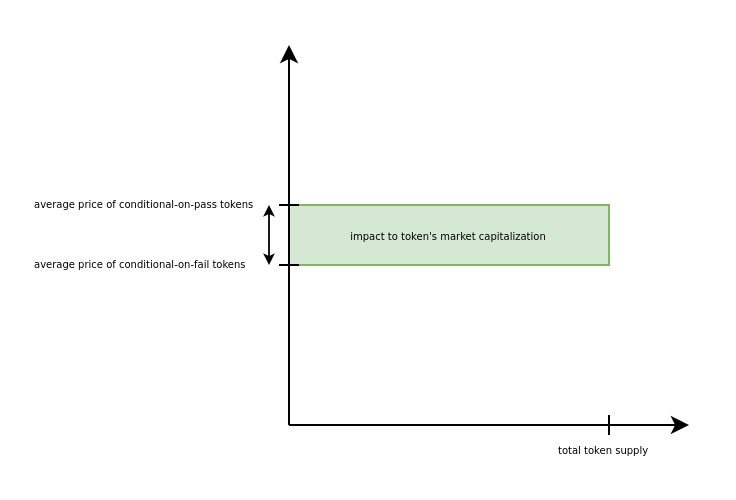

Explain how the Meta-DAO will solve the human coordination problem.

Outline:

In all prior approaches to human organization, humans have been the ones in command. Naturally, they all are prone to the stupidity and/or greed of their leaders. We propose an organization where control is handed to a neutral, reliable, and altruistic leader: executable computer code. Instead of this organization being led by a CEO, a board of directors, a legislature, a prime minister, or a family, it would have only one supreme commander: eBPF instructions stored on the Solana blockchain. In this post, we will construct this supreme commander.
Greatest good algorithm over expected_impact
Suppose our group is comprised of n members. Also suppose that we have a function that can compute how a given proposal will impact a member. i.e., you can call expected_impact(proposal, member) and it returns a signed number that tells you the magnitude of the impact on a member and whether it will be a positive or negative impact.
Ideal 'greatest good' algorithm: summate impacts on all members, execute proposal when proposal is good.
Using markets to calculate impact on each member

# From Corporations to Nations: How the Meta-DAO is Going to Change Everything (Part 3)

## Introduction

In all prior approaches to human organization, humans have been the ones in command. To ensure that these leaders serve the interests of the group, these approaches have tended to focus on either incentive-aligning these leaders or selecting altruistic leaders.

We propose an alternative organization where control is handed to executable computer code, namely eBPF instructions stored on the Solana blockchain. Here, we will describe the decision-making algorithm that will maintain control of this organization. 

## Ideal decision-making

In post 1, we stated that an ideal human organization is one in which all of its decision-makers try to do the greatest good for the greatest number. If an action would bring about more global benefit than cost, the ideal decision-maker takes that action. Stated differently, they follow this algorithm:

```rust
if predicted_global_benefit(action) > predicted_global_cost(action) {
    do(action);
} else {
    disregard(action);
}
```

To make things concrete with an example, let us suppose that Alice is a lemonade-stand operator who is considering the price of a cup of lemonade from 20 cents to 35 cents at the 3 stands under her control. 

If everyone continues to buy at 35 cents, the lemonade-stand franchise could profit substantially. But Alice knows that the price hike would deter some customers, and that the franchise would lose the profit from selling them 20-cent lemonades.

Alice estimates that stand #1 would gain $200 but lose $130, stand #2 would gain $700 and lose $250, and stand #3 would gain $400 but lose $600. 



Now if Alice is an ideal decision-maker,  she wants what's best for the lemonade franchise. Indeed, she might follow the above algorithm to make her decision:
- First, add up all expected profits
- Second, add up all expected losts profits (costs)
- Proceed if, and only if, total expected profits > total expected costs


Alice could also have done it another way without losing ideal decision-maker status:
- First, subtract the loss from the profit of each lemonade stand
- Second, summate all of these differences
- Proceed if, and only if, the sum > 0


Because addition and subtraction are commutative, these two are equivalent. Hence, the second algorithm is just as ideal as the first one.

## Adjudicating over member impacts

The second way that Alice could have made her decision closely resembles the algorithm of the Meta-DAO.

Instead of lemonade stands, the Meta-DAO is made up of *members*. A member is like a separate company in many regards; it can have its own assets, products, customers, and employees / core contributors. Importantly, each member has its own governance token, which is intended to function like common equity in a company.

When a proposal is raised for any member(s) to take an action, the core Meta-DAO algorithm makes the decision as follows:
- First, estimate the financial impact of this decision on each member, using negative numbers when a proposal would hurt a member financially
- Second, summate all of these financial impacts
- Take the action if, and only if, the sum > 0

In pseudocode:

```rust
let estimated_impact = 0;

for member in members {
    estimated_impact = estimated_impact + estimate_impact(member, action);
}

if estimated_impact > 0 {
    do(action);
} else {
    disregard(action);
}
```

## Estimating impact

For this algorithm to work, we need to be able to estimate the financial impact of a proposal on a member. To do this, we'll use a system based on Robin Hanson's [futarchy](https://mason.gmu.edu/~rhanson/futarchy.html). 

For each proposal, investors can lock tokens in a vault in exchange for two convertible instruments: one that converts back to the token if the proposal passes and one that converts if it fails. Because a proposal will pass or fail, but not both, the vault will always have exactly the same number of liabilities as assets.

By the prices of these convertible instruments, the Meta-DAO may estimate the financial impact of a proposal on a member. The Meta-DAO does this by first calculating the *pass price* and the *fail price* of a member's token. The pass price is the market estimate of 'how much would this member's token be worth if the proposal passed?' and the fail price is the estimate of the inverse, namely 'how much would this member's token be worth if the proposal failed?' Each can be calculated like so:
- Pass price = Price(convertible-on-pass member token) / Price(convertible-on-pass base token)
- Fail price = Price(convertible-on-fail member token) / Price(convertible-on-fail base token)

The base token can be any token that is used as a common base pair, such as SOL or USDC.

By taking the difference of the pass price and the fail price and multiplying the result by the member token's total supply, the Meta-DAO has an estimate of how a proposal will impact a member.



This mechanism works by leveraging the fact that market participants tend to price in information naturally. For example, suppose that there's a proposal to invest money into marketing a member's product to Eastern Europe. Also suppose that the pass and the fail price both start at $25. If trader Bob knows the Eastern European market and believes that the product would be a knockout success in the market, he is incentivized to lock up his base tokens, and trade his conditional-on-pass base tokens for conditional-on-pass member tokens. That way, he still gets back his base tokens if the proposal fails, but he has the potential to lock in the cheaper price if the proposal passes.

Although the market is unlikely to perfectly predict how a proposal will impact a member, markets have been empirically shown to be better predictors than experts. Importantly, markets are hard to manipulate, which makes the Meta-DAO difficult for humans to manipulate.

[TODO: add lots of sources here]

## Conclusion

We have demonstrated a design for a human organization where the managerial decisions are made by eBPF instructions on the Solana blockchain. Because this system is not human-led, it doesn't suffer some of the problems of prior approaches to human organization, including ensuring that the leader is either altruistic or incentive-aligned. 


