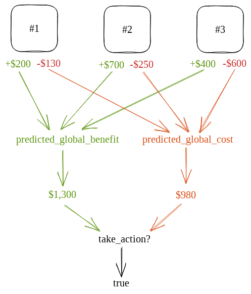
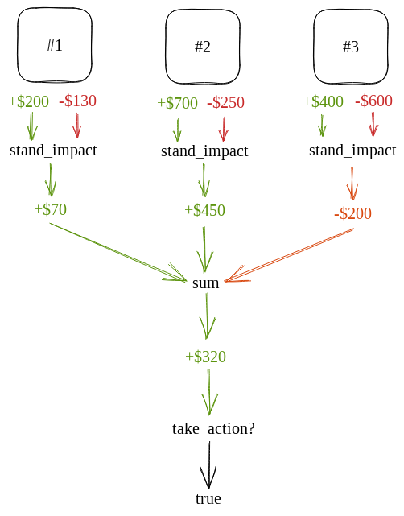

Explain how the Meta-DAO will solve the human coordination problem.

Outline:

In all prior approaches to human organization, humans have been the ones in command. Naturally, they all are prone to the stupidity and/or greed of their leaders. We propose an organization where control is handed to a neutral, reliable, and altruistic leader: executable computer code. Instead of this organization being led by a CEO, a board of directors, a legislature, a prime minister, or a family, it would have only one supreme commander: eBPF instructions stored on the Solana blockchain. In this post, we will construct this supreme commander.
Greatest good algorithm over expected_impact
Suppose our group is comprised of n members. Also suppose that we have a function that can compute how a given proposal will impact a member. i.e., you can call expected_impact(proposal, member) and it returns a signed number that tells you the magnitude of the impact on a member and whether it will be a positive or negative impact.
Ideal 'greatest good' algorithm: summate impacts on all members, execute proposal when proposal is good.
Using markets to calculate impact on each member

# From Corporations to Nations: How the Meta-DAO is Going to Change Everything (Part 3)

## Introduction

In all prior approaches to human organization, humans have been the ones in command. Naturally, they all are prone to the stupidity and/or greed of their leaders. We propose an organization where control is handed to a neutral, reliable, and altruistic leader: executable computer code. Instead of this organization being led by a CEO, a board of directors, a legislature, a prime minister, or a family, it would have only one supreme commander: eBPF instructions stored on the Solana blockchain. In this post, we will construct this supreme commander.

## The top-level algorithm

In post 1, we stated that an ideal human organization is one in which all of its decision-makers follow the ideal algorithm:

```rust
if predicted_global_benefit(action) > predicted_global_cost(action) {
    do(action);
} else {
    disregard(action);
}
```

This is the computer code version of Bentham's [Utilitarianism](https://en.wikipedia.org/wiki/Utilitarianism), which tells its followers to do the greatest good for the greatest number.

As an example, suppose that Alice is a lemonade-stand operator that and she is considering increasing prices at her three stands. If all of her customers continue to buy at these increased prices, the lemonade franchise stands to profit substantially. But some customers are likely to stop buying, which will reduce profits. Alice estimates that stand #1 would gain $200 but lose $130, stand #2 would gain $700 and lose $250, and stand #3 would gain $400 but lose $600. 

If Alice decides to follow the above algorithm to make her decision, she will first add up all her expected profits, then add up all of her expected costs, and then only proceed to raise prices if the expected profits are larger than the expected costs (in this case they are).



But Alice could also have done it another way: she could have first subtracted the profit from the loss of each lemonade stand, added together all of these figures, and then only raised prices if their sum was positive.



Because addition and subtraction are commutative, these two are equivalent. No matter what inputs, Alice will always get the same result. 

This latter approach is the top-level algorithm that will drive the Meta-DAO. 

Instead of lemonade stands, the Meta-DAO is made up of *members*. Each member is like an operating entity of a holding company, having its own assets, products, and contributors. 

Each decision is made by (1) estimating the financial impact on each member (2) only taking an action if it has a net-positive impact. In code form, that looks like this:

```rust
let estimated_impact = 0;

for member in members {
    estimated_impact = estimated_impact + estimate_impact(member, action);
}

if estimated_impact > 0 {
    do(action);
} else {
    disregard(action);
}
```


